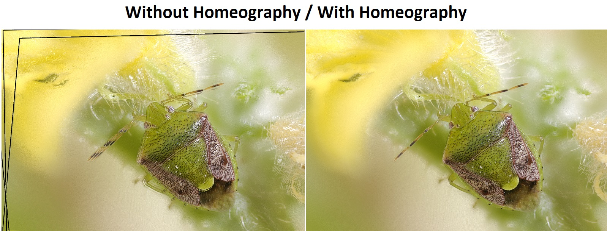

# focusstack

Simple Focus Stacking in Python

This is a fork.

## Requirements :

 - pip install numpy
 - download opencv-3.1.0.exe, run it to extract it, take : `extracted_folder\build\python\2.7\x64\cv2.pyd` and place it in `C:/Python27/lib/site-packages.`

## enhencements :

 - performs an homeography on all images to avoid ghosting
 - code has been adapted to run on OpenCv 3.1.0
 
 
 
## how to run :

 - run main.py and it will stack the files in the `input` folder